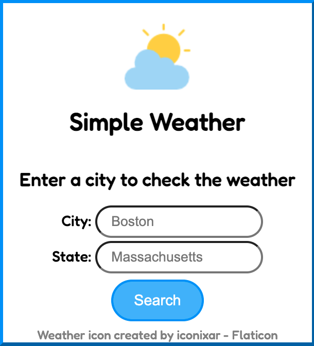
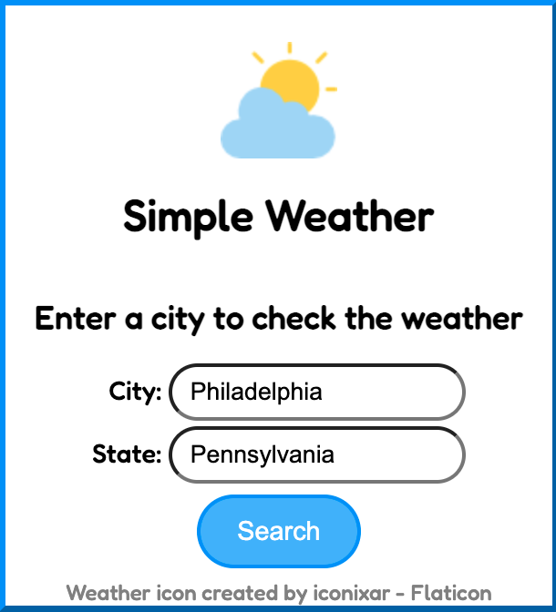
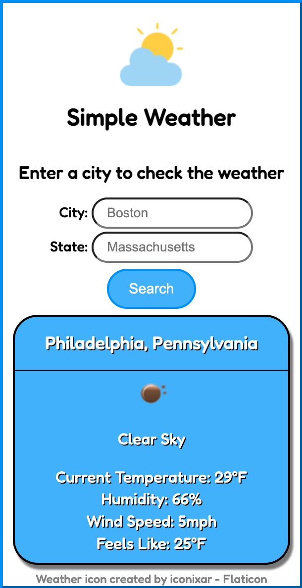

# Chrome Weather Extention

## Table of Contents

-   [Description](#description)
-   [Screenshots](#screenshots)
-   [Installation / Usage](#installation--usage)
-   [Tools](#tools)
-   [License](#license)

### Description

A simple extension for Chrome that allows users to view the current weather for a specified city in the United States.

### Screenshots

### Installation / Usage

1. Clone the repository
2. Navigate to the extensions page in Google Chrome
3. In the top left enable Developer mode
4. In the top right click "Load unpacked"
5. Select the Chrome Weather Extension folder on your computer
6. Click on the puzzle piece in the top right of Google Chrome
7. Select the Simple Weather Extension
8. Enter a City and State to get the current weather for that location

### Tools

This extension was built with:

- HTML5
- CSS3
- JavaScript
- [Open Weather Map API](https://openweathermap.org/api)

#### License

